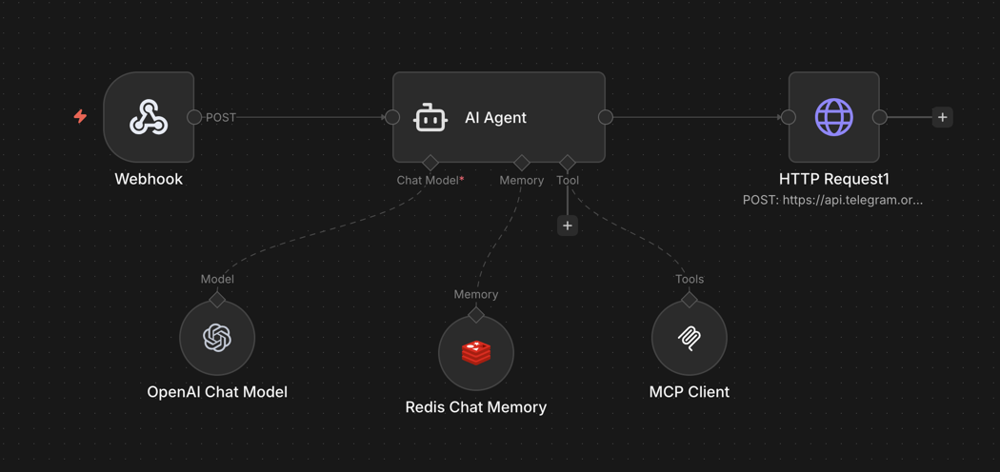

# n8n-telegram-trigger

A Telegram bot that forwards messages to n8n webhooks, enabling workflow automation triggered by Telegram messages.

## Why This Exists

n8n's built-in Telegram trigger requires a webhook, which means your n8n instance must be publicly accessible from the internet. This creates problems:

- **Tunneling workarounds**: Many users resort to tools like ngrok, Cloudflare Tunnels, or localtunnel just to receive Telegram messages
- **Security risks**: Exposing n8n to the internet opens your workflow automation platform to potential attacks, even if you only intended to receive Telegram updates
- **Unnecessary complexity**: Managing tunnels, domains, and SSL certificates adds overhead to what should be a simple integration

This bot solves the problem by using Telegram's long polling instead of webhooks. Your n8n instance stays completely internal—the bot pulls updates from Telegram and pushes them to your local n8n webhook.



## Features

- Forwards Telegram messages to n8n webhooks as JSON
- User access control via allowed user IDs
- `/id` command to retrieve your Telegram user ID
- Retry logic for failed webhook requests
- Minimal Docker image using scratch base

## Requirements

- Docker and Docker Compose
- Telegram bot token (from [@BotFather](https://t.me/BotFather))
- n8n instance with internal webhook endpoint

## Configuration

Create a `.env` file:

```env
TELEGRAM_TOKEN=your_telegram_bot_token
N8N_WEBHOOK=http://n8n:5678/webhook/your-webhook-id
ALLOWED_USERS=123456789,987654321
```

| Variable | Description |
|----------|-------------|
| `TELEGRAM_TOKEN` | Your Telegram bot token |
| `N8N_WEBHOOK` | n8n webhook URL to receive messages |
| `ALLOWED_USERS` | Comma-separated list of allowed Telegram user IDs |

## Usage

### With existing n8n instance

1. Make sure your n8n is running on the `n8n-network` Docker network

2. Start the bot:
   ```bash
   docker compose up -d --build
   ```

### Standalone deployment (n8n + bot together)

Use the combined compose file to run both n8n and the bot:

```bash
docker compose -f docker-compose.n8n.yml up -d --build
```

n8n will be available at `http://localhost:5678`.

### Getting started

1. Send `/id` to the bot to get your Telegram user ID

2. Add your user ID to `ALLOWED_USERS` and restart

3. Messages from allowed users will be forwarded to your n8n webhook

## License

MIT